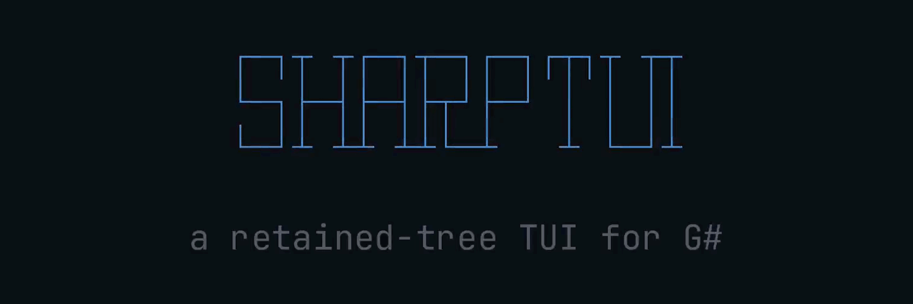

<p align="center"></p>

# sharptui

<p>
  <a href="https://github.com/obselate/sharptui/actions/workflows/ci.yml"></a>
  
  <a href="https://github.com/DavidOBando/gsharp"></a>
  <a href="LICENSE"></a>
</p>

A small retained-tree TUI framework for G#.

## Install

Clone sharptui next to your application and reference the framework project
from your own `.gsproj`. The G# compiler, `Gsharp.NET.Sdk`, restores from
NuGet and needs only the .NET 10 SDK.

```sh
git clone https://github.com/obselate/sharptui
```

```xml
<Project Sdk="Gsharp.NET.Sdk/0.3.633">

  <PropertyGroup>
    <OutputType>Exe</OutputType>
    <TargetFramework>net10.0</TargetFramework>
  </PropertyGroup>

  <ItemGroup>
    <ProjectReference Include="../sharptui/SharpTui.Framework.gsproj" />
  </ItemGroup>

</Project>
```

## Documentation

- [G# language and tooling](https://github.com/DavidOBando/gsharp)
- [Performance and allocation numbers](docs/performance.md)
- [examples/](examples/): seven complete applications, from a file browser to a git workbench
- [LICENSE](LICENSE): MIT, with vendored Yoga.Net provenance in [vendor/Yoga.Net/UPSTREAM.md](vendor/Yoga.Net/UPSTREAM.md)

## Example

Save this as `Main.gs` beside the project file above and `dotnet run`.

```gs
package Demo

import SharpTui

func Main(args []string) int32 {
  let root = Column{
    Padding: CellInsets.All(1),
    GapCells: 1,
    Children: {
      Label{ Text: "sharptui" },
      Row{
        GrowWeight: 1,
        Children: {
          Box{ Width: CellLength.Cells(24), ShowBorder: true, Title: "Files" },
          MarkdownView{ GrowWeight: 1, Source: "# Hello" },
        },
      },
    },
  }
  let app = App()
  app.Run(root)
  return 0
}
```

Escape or Ctrl+C quits. Run the bundled examples with
`dotnet run -c Release --project SharpTui.Examples.gsproj`.
